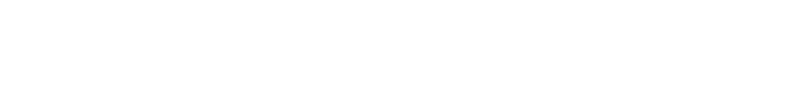

# XGBoost2GPU

[](https://python.org)
[](https://opensource.org/licenses/MIT)
[](https://developer.nvidia.com/cuda-downloads)

>  **A Python library to generate optimized CUDA code from XGBoost models using TreeLUT quantization for high-performance GPU inference.**


<p align="center">
    
</p >


XGBoost2GPU transforms your trained XGBoost models into highly optimized CUDA code, enabling lightning-fast inference on GPUs with advanced pruning strategies and quantization techniques.


##  Installation

> [!WARNING]
>  This library requires NVIDIA GPU with CUDA support and TreeLUT dependencies.

### Prerequisites

Before installing XGBoost2GPU, ensure you have:

- **Python 3.8+**
- **CUDA 11.0+** ([Download CUDA](https://developer.nvidia.com/cuda-downloads))
- **NVIDIA GPU** with compute capability 6.0+
- **Git** for dependency installation

### Install from Source

```bash
# Clone the repository
git clone https://github.com/Olavo-B/XGBoost2GPU.git
cd XGBoost2GPU

# Create virtual environment (recommended)
python -m venv venv
source venv/bin/activate  # On Windows: venv\Scripts\activate

# Install the package
pip install -e .
```

### Install Dependencies

```bash
# Install all dependencies including TreeLUT
pip install -e ".[all]"

# Or install development dependencies
pip install -e ".[dev]"
```

> [!NOTE]
> TreeLUT and LoadDataset are automatically installed from GitHub repositories.

##  Quick Start

### Basic Usage

```python
from xgboost2gpu import XGBoost2GPU
from treelut import TreeLUTClassifier
import xgboost as xgb
import numpy as np

# 1. Train your XGBoost model
X_train, y_train = load_your_data()  # Your data loading function
xgb_model = xgb.XGBClassifier(n_estimators=10, max_depth=5)
xgb_model.fit(X_train, y_train)

# 2. Convert to TreeLUT
treelut_model = TreeLUTClassifier(
    xgb_model=xgb_model,
    w_feature=3,     # Feature quantization bits
    w_tree=3,        # Tree quantization bits
    quantized=True
)
treelut_model.convert()

# 3. Generate CUDA code
xgb2gpu = XGBoost2GPU(
    treelut_model=treelut_model,
    w_feature=3,
    w_tree=3,
    n_samples=1000
)

# 4. Generate optimized CUDA kernel
xgb2gpu.generate_cuda_code("inference.cu")

# 5. Apply pruning for optimization
xgb2gpu.calculate_forest_probabilities(
    percentage_to_cut=0.1,
    strategy="adaptive"
)

print("✅ CUDA code generated successfully!")
```


##  Usage Examples

### Complete Workflow Example

> [!TIP]
> Check out the [complete Jupyter notebook example](misc/example/xgboost2gpu_example.ipynb) for a full workflow demonstration.


### Compilation and Execution

```bash
# Compile the generated CUDA code
nvcc -arch=sm_75 -O3 -o inference optimized_inference.cu

# Run inference (requires input.csv and expected_output.csv)
./inference
```

##  Configuration

### Pruning Strategies

XGBoost2GPU supports multiple pruning strategies to optimize model performance:

| Strategy | Description | Use Case |
|----------|-------------|----------|
| `linear` | Linear probability distribution | Uniform pruning |
| `exponential` | Exponential decay by tree depth | Deep tree optimization |
| `adaptive` | Dynamic pruning based on importance | Best balance |
| `random` | Random pruning | Testing/debugging |

### Configuration File Example

```json
{
    "percentage_to_cut": 0.15,
    "strategy": "adaptive",
    "level_importance": 0.7,
    "progress_importance": 0.3,
    "level_bias": 1.5,
    "max_cut_percentage": 0.25,
    "urgency_override_threshold": 1.2
}
```

### Model Parameters

| Parameter | Type | Default | Description |
|-----------|------|---------|-------------|
| `w_feature` | int | 3 | Feature quantization bits (1-8) |
| `w_tree` | int | 3 | Tree quantization bits (1-8) |
| `n_samples` | int | 1000 | Number of inference samples |
| `n_threads` | int | 1024 | CUDA threads per block |
| `n_blocks` | int | 768 | Number of CUDA blocks |


##  Development

### Project Structure

```
XGBoost2GPU/
├── src/xgboost2gpu/          # Main package
│   ├── __init__.py           # Package initialization
│   ├── xgboost2gpu.py        # Core XGBoost2GPU class
│   └── treePruningHash.py    # Pruning utilities
├── misc/example/             # Usage examples
├── misc/docs/                # Documentation
├── test/                     # Unit tests
├── requirements.txt          # Dependencies
├── setup.py                  # Package setup
└── README.md                 # This file
```


### Known Limitations

- **CUDA Compute Capability**: Requires 6.0+ (Maxwell architecture or newer)
- **Model Size**: Very large models may exceed GPU memory limits
- **Precision**: Quantization may affect model accuracy (typically <1% loss)
- **Dependencies**: Requires TreeLUT framework (automatically installed)

### Troubleshooting

| Issue | Solution |
|-------|----------|
| `ModuleNotFoundError: No module named 'treelut'` | Install with `pip install -e ".[all]"` |
| CUDA compilation errors | Check CUDA version and GPU compute capability |
| Memory errors | Reduce `n_samples` or model size |
| Import errors | Ensure virtual environment activation |

## 🤝 Contributing

We welcome contributions! Here's how to get started:


## 📄 License

This project is licensed under the MIT License - see the [LICENSE](LICENSE) file for details.

## Authors

- **Olavo Alves Barros Silva** - *Initial work* - [GitHub](https://github.com/Olavo-B)
  - Email: olavo.barros@ufv.com
  - Institution: Universidade Federal de Viçosa (UFV)

## Acknowledgments

- **TreeLUT** quantization framework
- **XGBoost** community for the excellent ML library
- **NVIDIA** for CUDA development tools
- **Open Source** community for inspiration and feedback


## 🔗 Related Projects

- [TreeLUT](https://github.com/Olavo-B/TreeLUT) - Tree quantization framework
- [LoadDataset](https://github.com/Olavo-B/LoadDataset) - Dataset utilities
- [XGBoost](https://github.com/dmlc/xgboost) - Gradient boosting framework

---

